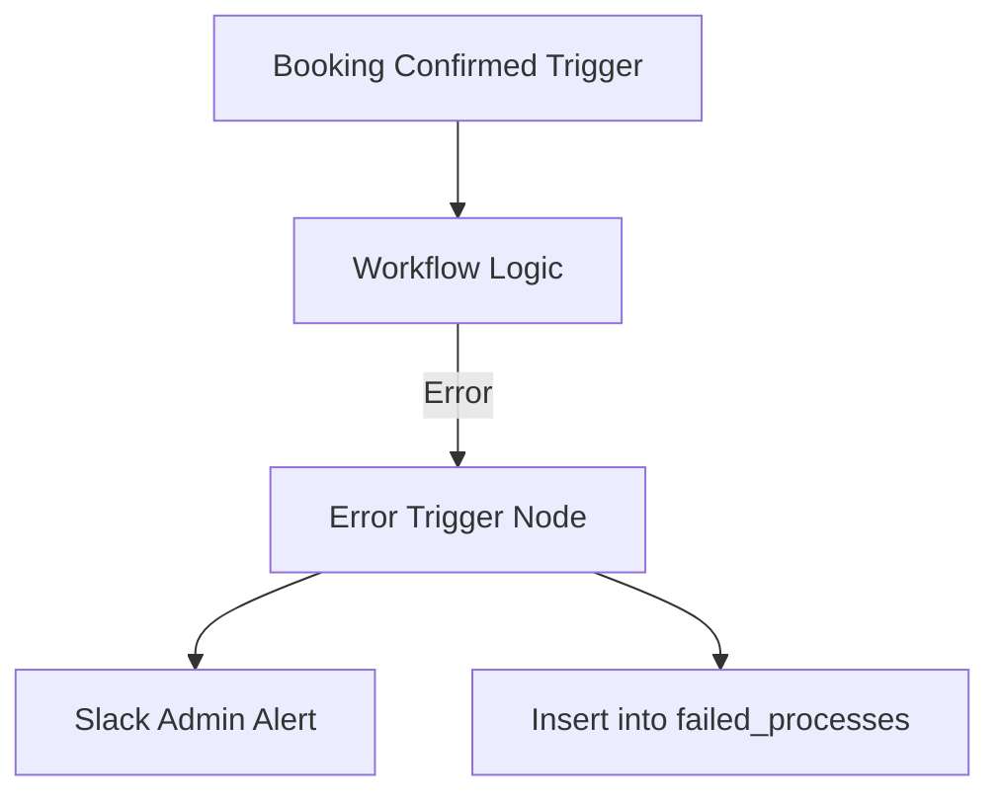

# Workflow Architecture Record: 'Booking Confirmed' Email Automation

This document establishes the production-grade architectural standards and deployment protocols for the "Booking Confirmed" email automation. As a mission-critical middleware component, this workflow is engineered for high availability, relational data integrity, and defensive security.

## 1. Architectural Infrastructure & Environment Configuration

### Hostinger VPS Foundation
To maintain the performance of the Node.js event loop and handle the I/O demands of n8n’s execution logs, this system is deployed on Hostinger KVM-based VPS hardware.

* **KVM 2 (Standard):** 2 vCPU, 8 GB RAM, 100 GB NVMe. Supports 1–3 workers.
* **KVM 4 (Enterprise):** 4 vCPU, 16 GB RAM, 200 GB NVMe. Required for high-concurrency environments.
* **Note on I/O:** NVMe storage is non-negotiable to prevent "database locked" errors during high-frequency execution writes.

### n8n Operational Mode: Queue Mode
The architecture utilizes Queue Mode to decouple trigger ingestion from heavy computational tasks.

| Component | Role | Production Configuration |
|---|---|---|
| Main Process | UI & Trigger Listener | Serves /rest/* and /editor/* traffic. |
| Redis | Message Broker | Orchestrates job distribution and state management. |
| PostgreSQL | Persistent State Store | The "Source of Truth" for definitions and history. |
| Worker(s) | Computational Nodes | Independent processes executing the workflow logic. |

### Database Engineering & Tuning
A common failure point is n8n attempting to start before the database is ready.

* **Health Check:** The Docker configuration must implement a healthcheck using `test: ["CMD-SHELL", "pg_isready -h localhost -U $POSTGRES_USER"]`.
* **Dependency Logic:** Use `depends_on: { postgres: { condition: service_healthy } }`.
* **Performance Tuning:** `shared_buffers` must be set to 25% of total RAM; `max_connections` should be tuned to 200+ to accommodate multiple workers.
* **Permissions Warning:** You must run `chown -R 1000:1000` on the host data directories. Failure to do so results in "silent credential disappearance" where data appears saved but is lost on restart.

### Environment Variables
Configure the .env file with 600 permissions.

* `EXECUTIONS_MODE=queue`
* `N8N_ENCRYPTION_KEY`: A 32-character high-entropy hex string.
* **Security Warning:** Avoid `N8N_ENCRYPTION_KEY_FILE`. Due to the trailing newline/mount bug, workers often fail to read the key from files, leading to decryption errors. Inject the key directly.

---

## 2. Ingress: Webhook Trigger & Security Hardening

### Webhook Node Configuration
The entry point is a Webhook node listening for the Booking Confirmed event. It is configured to respond immediately with a 200 status to free the calling service.

### Ingress Security & CVE Compliance
1. **SSL Termination:** Traefik manages SSL certificates via Let’s Encrypt.
2. **Hardened Proxy Headers:** Set `X-Forwarded-For`, `X-Forwarded-Host`, and `X-Forwarded-Proto`.
3. **IP Identification:** Set `N8N_PROXY_HOPS=1` to ensure n8n accurately identifies client IPs for auditing.
4. **Infrastructure Whitelisting:** Following CVE-2025-68949, IP filtering must be moved to the Nginx/Proxy layer. This prevents malicious traffic from hitting the Node.js event loop, mitigating IP whitelist bypass vulnerabilities.
5. **Firewall (UFW):** "Deny all" posture. Only 80, 443, and 22 (via Ed25519 keys) are permitted. Port 5678 is never public.

### Validation Logic (Guard Pattern)
A Dead-Branch Detector validates the payload early. If `booking_id` or `customer_email` is missing, the workflow terminates immediately, preventing "zombie" executions and providing meaningful logs.

---

## 3. The 'Pizza Tracker' Polling Loop (Supabase State Machine)

### Context Mesh Integration
The workflow uses a State Machine Pattern to monitor transitions. It interacts with the Context Mesh—a relational knowledge graph—using Supabase Remote Procedure Calls (RPCs).

The polling loop calls the `search_unified` RPC, which utilizes Reciprocal Rank Fusion (RRF) to combine:
* **Vector Search:** Semantic relevance.
* **Full-Text Search (FTS):** Lexical accuracy.
* **Graph Search:** Relational context (linking Customers ⇄ Orders ⇄ Tickets).

### Polling Precision & Backoff
Instead of simple status checks, the loop retrieves "Customer 360" data (Lifetime Value, support history).

* **Pattern 1: Exponential Backoff:** If the status is not confirmed, the workflow waits with increasing delays (5s, 10s, 20s, 40s) to avoid API rate-limiting.
* **Retry Limits:** Capped at 5 attempts before escalating to the Dead Letter Queue.

---

## 4. Data Normalization & Dynamic Payload Generation

### "Normalize First" Strategy (Pattern #3)
The raw Supabase/Webhook payload is flattened and typed early. This ensures downstream reliability and Item Linking accuracy, maintaining the mapping between the trigger item and sub-workflow results even if upstream field names drift.

### Dynamic Add-on Logic
The workflow iterates through booking line items to generate the email body:
* **Iterative Logic:** Processes each add-on (e.g., equipment rental, insurance).
* **Conditional Injection:** Injects specific HTML fragments only if the add-on exists in the normalized schema.

### Token Usage Tracking
If AI nodes generate the email content, token costs are monitored.
* **Architectural Workaround:** Since `tokenUsage` data is often unavailable on the AI Agent node, the workflow must extract the `tokenUsageEstimate` object directly from the Chat Model sub-node. This data is then routed to a SaaS billing sub-workflow to deduct from user balances.

---

## 5. Outbound Communication: Resend HTTP Configuration

### HTTP Request Node Setup
* **Method:** POST | **URL:** `https://api.resend.com/emails`
* **Header:** `Authorization: Bearer [API_KEY]`
* **Retry Logic:** Standardized "Retry on 429" with exponential backoff is enforced to handle Resend API throttling.

### Payload Schema
```json
{
  "from": "Bookings <confirmations@yourstore.com>",
  "to": "customer@example.com",
  "subject": "Confirmed: Order #{{$json.booking_id}}",
  "html": "<html>...{{$json.normalized_body}}...</html>"
}
```

---

## 6. Resilience & Fallback Mechanisms

### Supabase Status Fallback
After the Resend API returns a successful ID, the workflow executes a final RPC to mark the record as `email_sent: true` and timestamp the delivery.

### Error Handling Architecture
Any node failure triggers the Error Handler workflow.



### Dead Letter Queue (DLQ)
Failed attempts are routed to a `failed_processes` table in Supabase.
* **DLQ Schema:** `error_message` (string), `data` (JSONB), `timestamp` (TIMESTAMPTZ), `execution_id` (string).
* **Manual Review:** Ensures no customer lead is lost to transient API failures or malformed data.

---

## 7. Maintenance & Observability

### Automated Backups & CI/CD
* **Daily Export:** At 03:00, the system runs `n8n export:workflow --all` and pushes to a private Git repository.
* **Deployment Pipeline:** Supports "Auto deploy to dev/prod" tags.
* **Startup Variables:** The environment utilizes `STARTUP_WORKFLOWS_LOAD_LOCATION` and `STARTUP_WORKFLOW_ID` to re-initialize and auto-start critical flows after deployment or container restart.

### Monitoring Metrics (The Four Pillars)
1. **Logging:** Structured JSON logs in PostgreSQL.
2. **Metrics:** Tracking success/failure ratios and SaaS token spend.
3. **Tracing:** Using Correlation IDs to track a single booking ID across the n8n, Supabase, and Resend stack.
4. **Alerting:** Critical node failures result in immediate Slack notifications with direct execution links.

### Operational Warning
**Infinite Loops:** When implementing manual schema validation loops (Pattern 4), always include a `runIndex` counter. Capping retries at 4 prevents infinite AI-regeneration loops and runaway API costs if the LLM fails to produce valid JSON.
